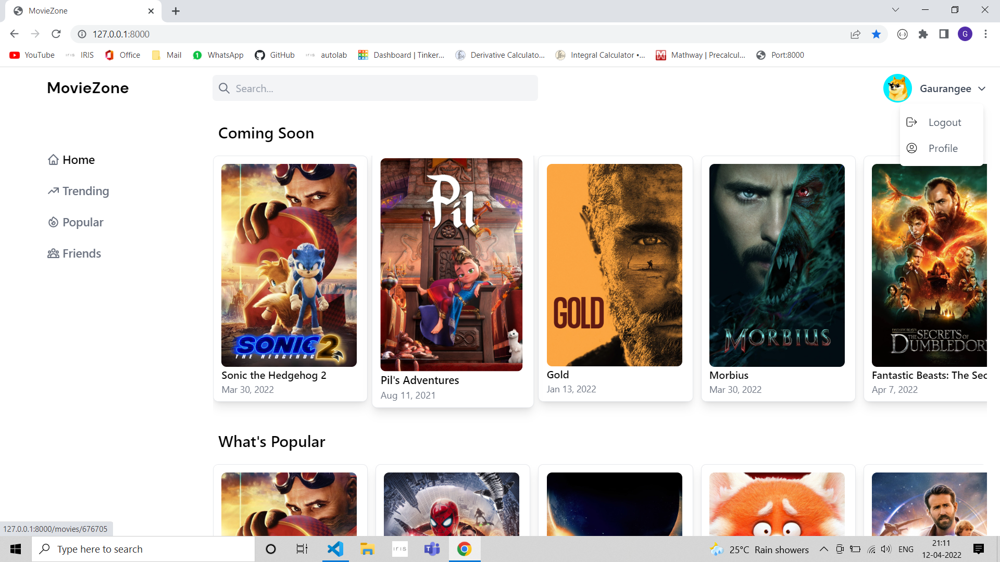
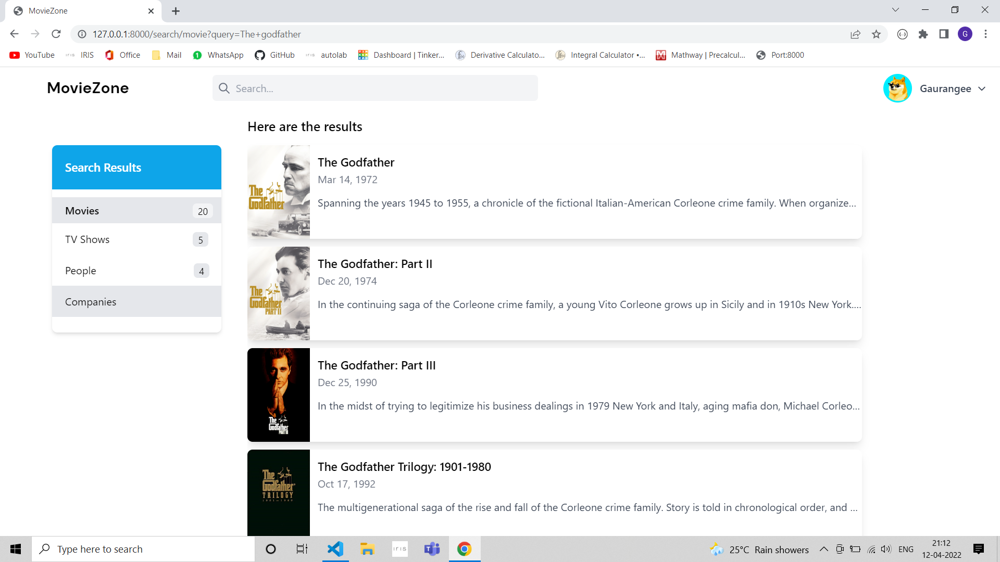
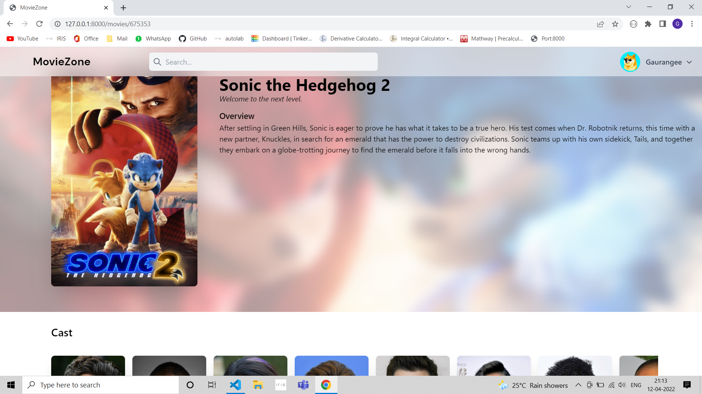
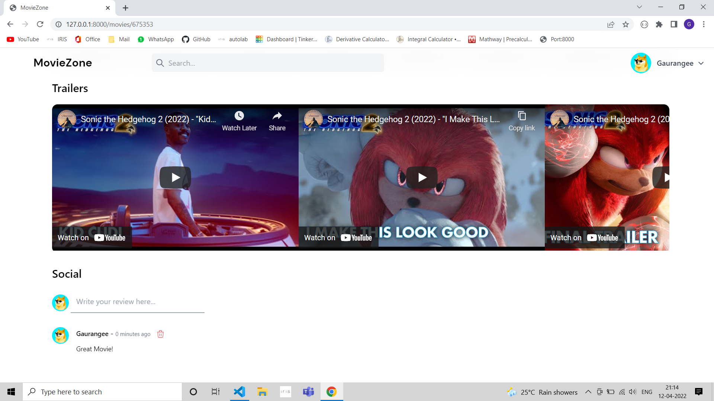
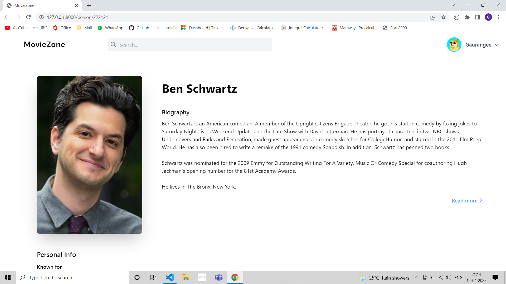
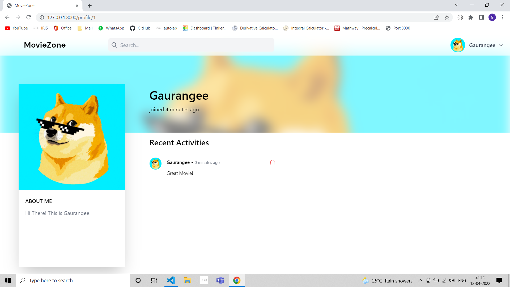
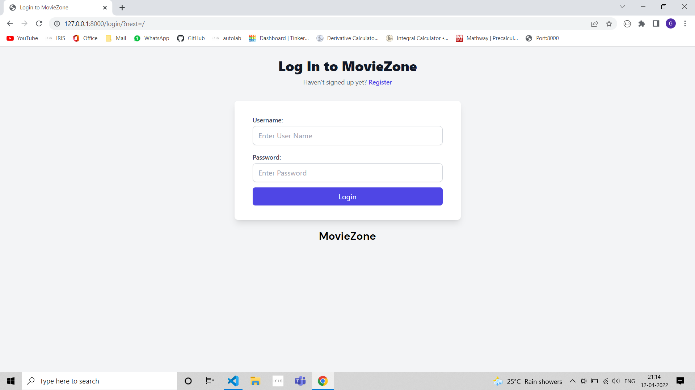
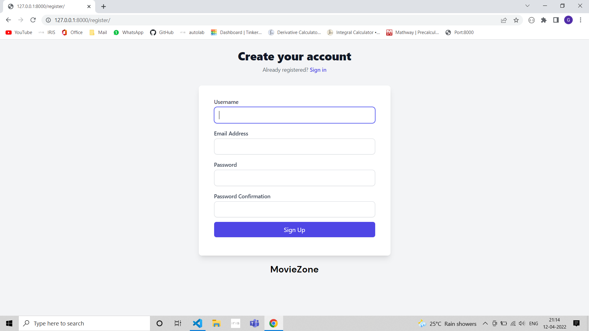
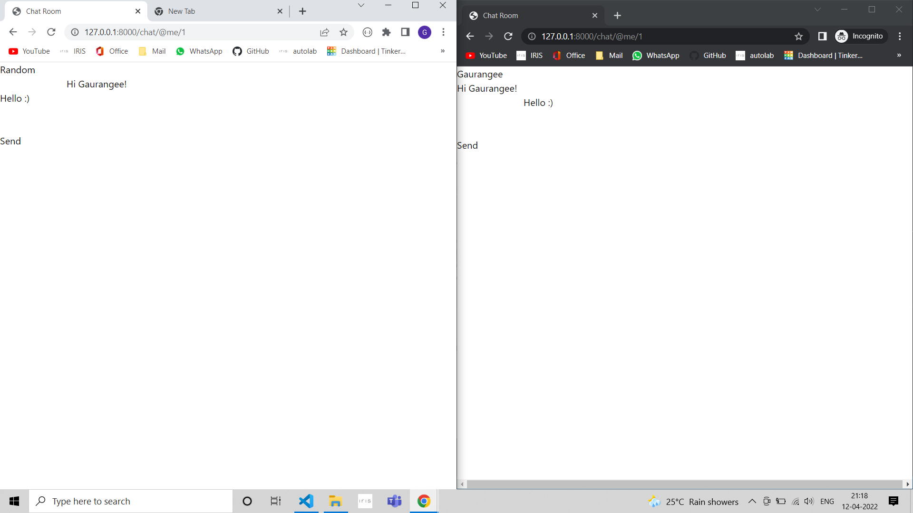

# MovieZone

# Snapshots

# Build Instructions

### Clone the project

`git clone --recursive https://github.com/Gaurangee-Parashar/MovieZone.git`  
`cd MovieZone`

### Create a new virtual env inside the cloned repository

`virtualenv env`

(Make sure to have the virtual env module installed through pip)

### Installing the required dependencies

`pip install -r requirements.txt`

### Migrating the sqlite3 database tables

`python manage.py makemigrations` 
`python manage.py migrate`

### Running the django development server

`python manage.py runserver`

